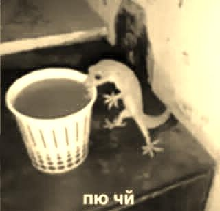
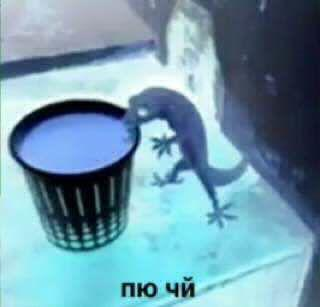

# Image Processing

### Build

1. Clone repo
2. `cmake -DCMAKE_CXX_COMPILER=clang++ -DCMAKE_BUILD_TYPE=[Debug|Release|Sanitized] [path/to/source]`
3. `make`
4. `./image_processing -i file_input -e effect -f format`

```
Usage:
./image_processing -i file_input -e effect -f format
Allowed options:
  -h [ --help ]         print command usage
  -i [ --input ] arg    input file
  -f [ --format ] arg   file format
  -e [ --effect ] arg   file effect

```

### Available extensions

1. BMP

### Available effects

1. Sepia
2. Negative

### Add new extension
Place file in `src/formats`

```c++
#include "IFormat.h"

class NewFormat : public IFormat {
    public:
    NewFormat() = default;

    Image get_image(std::filesystem::path filename) override;

    void save_image(const Image &image, std::filesystem::path filename) override;
};

extern "C" {
    IFormat *create_format_plugin();
}
```

### Add new format
Place file in `src/effects`

```c++
#include "IEffect.h"

class NewEffect : public IEffect {
    public:
    NewEffect() = default;

    Image apply_effect(const Image &image) override;
};

extern "C" {
    IEffect *create_effect_plugin();
}
```


### Example

- Orig

  
    
- Sepia

  

- Negative

  

